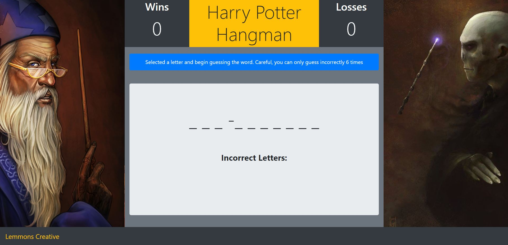
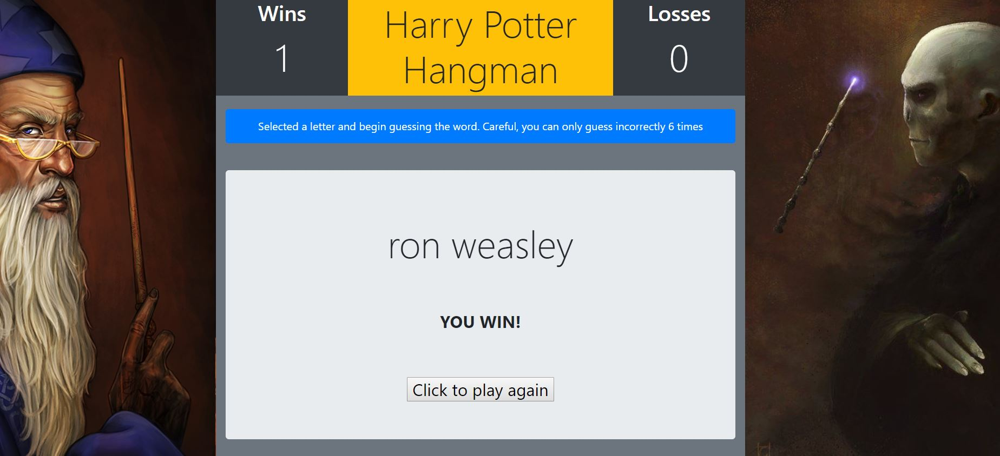
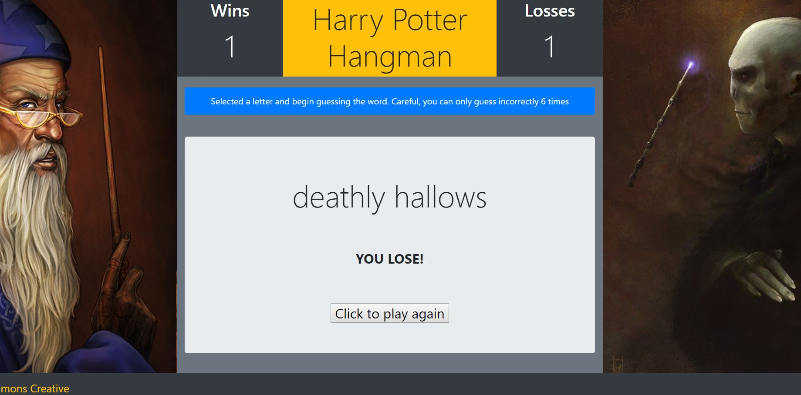

# bootstrap-hangman
a hangman game allowing user to select a letter on the keyboard to guess 
if that letter is in a random word selected. If the user guesses incorrectly more than 6 times then the game is over and a loss is tallied.
if the user guessed the correct letters completing the word the a win in tallied.

## Technologies used:
- HTML
- CSS
- Boostrap
- JavaScript
- jQuery

## Installation
- open the HTML file provided

## Screenshots
### Landing Page:

### Guessing Letters:

### Win Game:

### Lose Game:

## Author
Michael Emmons
